# HELMo Oracle — Review Technique (Exam Oral)

> Niveau cible : tu connais le frontend Next.js et les 4 piliers du Retrieval (semantic, BM25, hybrid, RRF),
> mais tu découvres les mécanismes internes du backend Python.

---

## Thème 1 — Architecture & Point d'entrée

### 1.1 Le projet en une image

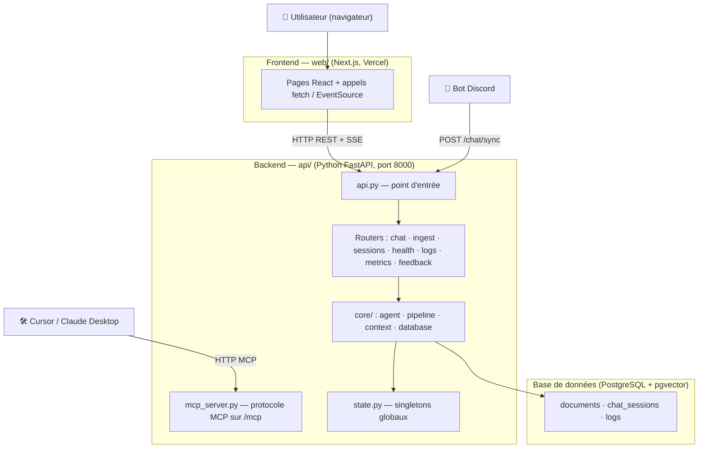

Trois types de clients : le **navigateur** (via le frontend), le **bot Discord** (appel API direct), et des **LLMs externes** comme Cursor (via le protocole MCP expliqué en 1.7).

---

### 1.2 FastAPI — c'est quel type d'API ?

FastAPI construit des **API REST** (REpresentational State Transfer). REST n'est pas un protocole technique — c'est un ensemble de conventions que tout le monde a décidé de respecter pour que les APIs soient prévisibles et cohérentes.

**Les conventions REST :**
- On utilise les **verbes HTTP** pour exprimer l'action : `GET` = lire, `POST` = créer, `PATCH` = modifier partiellement, `DELETE` = supprimer
- On identifie les **ressources** par des URLs claires : `/sessions` = toutes les sessions, `/sessions/abc-123` = une session précise
- Le serveur est **stateless** (sans état) : il ne se souvient pas de toi entre deux requêtes. Chaque requête doit contenir toutes les infos nécessaires (ex: le `session_id` dans le body)
- Les réponses sont en **JSON**

```
GET  /sessions           → liste toutes mes sessions
GET  /sessions/abc-123   → récupère la session abc-123
POST /chat               → envoie un message, crée une interaction
DELETE /sessions/abc-123 → supprime la session abc-123
```

FastAPI crée une instance d'application et y branche des **routers** — des fichiers qui regroupent les routes d'une même fonctionnalité :

```python
# api.py
app.include_router(chat.router)      # /chat, /chat/sync, /archives
app.include_router(sessions.router)  # /sessions, /sessions/{id}
app.include_router(ingest.router)    # /ingest, /ingest/status, /ingest/cancel
# ...
```

**Uvicorn** est le serveur qui fait vraiment tourner FastAPI. Il écoute sur le port 8000 et transfère les requêtes HTTP à FastAPI.

```
Navigateur  →  Uvicorn (port 8000)  →  FastAPI  →  ta fonction Python
```

---

### 1.3 C'est quoi un Middleware ?

Imagine que chaque requête HTTP est un colis entrant dans un bâtiment. Les **middlewares** sont les agents dans le couloir — chaque colis passe devant eux **avant** d'arriver à destination, et **après** le retour aussi.

```
Requête entrante
      │
      ▼
┌──────────────────────┐
│  Middleware : CORS   │  ← inspecte l'origine, ajoute des headers
└──────────┬───────────┘
           ▼
    Ta route (/chat)
           │
        Réponse
           │
  (repasse par le middleware)
```

Dans notre projet, on a un seul middleware : le **CORS** (Cross-Origin Resource Sharing — partage de ressources entre origines différentes).

**Pourquoi le CORS ?** Le navigateur bloque par défaut les requêtes HTTP vers un domaine différent de la page actuelle — c'est une protection de sécurité du navigateur. Notre frontend est sur `vercel.app`, notre API sur `api.dlzteam.com` → domaines différents → bloqué sans CORS.

Le middleware ajoute automatiquement sur chaque réponse les headers HTTP qui autorisent l'accès :

```python
# api.py
app.add_middleware(
    CORSMiddleware,
    allow_origins=ALLOWED_ORIGINS,   # ex: ["https://mon-site.vercel.app"]
    allow_credentials=True,
    allow_methods=["GET", "POST", "PATCH", "DELETE"],
    allow_headers=["Content-Type", "X-API-Key"],
)
```

`ALLOWED_ORIGINS` est lue depuis le fichier `.env`. En dev : `http://localhost:3000`. En prod : l'URL Vercel.

> **Piège :** si `ALLOWED_ORIGINS` est vide, FastAPI bloque TOUT — même les appels légitimes. Le code logge un warning mais ne plante pas.

---

### 1.4 Asyncio — pourquoi et comment

**Le problème :** appeler un LLM (Groq, OpenAI...) prend 2-5 secondes. Si Python attend sans rien faire pendant ce temps, il ne peut traiter aucune autre requête.

**La solution — asyncio :** Python peut "mettre en pause" une fonction en attente et s'occuper d'autre chose entre-temps. Les fonctions qui savent être mises en pause s'écrivent avec `async def` et `await`.

```python
# Sans asyncio — BLOQUANT
def chat():
    result = appel_llm()    # Python s'arrête ici 5 sec, rien d'autre ne tourne
    return result

# Avec asyncio — NON BLOQUANT
async def chat():
    result = await appel_llm()  # "je mets en pause, reviens quand c'est prêt"
    return result               # pendant ces 5 sec, Python traite d'autres requêtes
```

**ASGI** (Asynchronous Server Gateway Interface) est le standard qui définit comment Uvicorn et FastAPI communiquent ensemble en mode async. C'est l'équivalent moderne de WSGI (utilisé par Flask/Django classique qui, eux, sont synchrones).

**Problème concret :** LangGraph et les clients LLM (Groq, OpenAI...) ne sont **pas** async — ce sont des bibliothèques synchrones (bloquantes). On ne peut pas les `await`. Solution : `asyncio.to_thread()`.

```python
# routers/chat.py
agent_task = asyncio.create_task(asyncio.to_thread(
    _run_agent,   # fonction synchrone bloquante
    session=session, ...
))
```

`asyncio.to_thread()` exécute la fonction dans un **thread système séparé**. La boucle asyncio continue à tourner et traite d'autres requêtes pendant ce temps.

```
Event loop asyncio (1 fil Python)
    │
    ├── Chat user 1 ── await to_thread(_run_agent) ──► Thread OS #1  (LangGraph, 5 sec)
    │
    ├── Chat user 2 ── await to_thread(_run_agent) ──► Thread OS #2  (LangGraph, 5 sec)
    │
    └── GET /health ── répond immédiatement ✓
```

---

### 1.5 `state.py` — le registre global de l'application

Tous les routers font `import state` mais `state.py` **n'est pas dans git** — il est généré au démarrage par un script de lancement externe. Il contient les singletons partagés de toute l'application.

**Pourquoi ce pattern ?** Si tu dois partager la connexion à la base de données entre 7 routers, tu as deux options :

```python
# Option A — couplage faible : passer en paramètre
def chat(req, vm, mm, config, pii):   # lourd, répété partout
    ...

# Option B — module global (ce qu'on a fait)
import state
def chat(req):
    state.vm.search(...)   # accès direct, simple
```

**Couplage fort** = une pièce du code dépend directement d'une autre pièce spécifique. Ici : si tu renommes `state.vm`, tu dois modifier tous les routers. C'est l'opposé du **couplage faible**, où chaque module est indépendant et reçoit ce dont il a besoin sans savoir d'où ça vient.

> **Analogie :** couplage fort = branché en dur dans le mur. Couplage faible = prise électrique, tu branches ce que tu veux.

| Nom dans state | Type | Rôle |
|---|---|---|
| `state.vm` | VectorManager | Connexion PostgreSQL + recherche vectorielle |
| `state.mm` | MemoryManager | Gestion de la mémoire de conversation |
| `state.pii` | PIIManager | Masquage des données personnelles |
| `state.config` | dict | Config (provider par défaut, températures...) |
| `state.ingest_status` | dict | État courant de l'ingestion |
| `state.ingest_cancel` | threading.Event | Signal d'annulation de l'ingestion |
| `state.ADMIN_API_KEY` | str | Clé secrète pour les routes admin |
| `state.BASE_SYSTEM_PROMPT` | str | Prompt système chargé depuis `config/prompt.txt` |
| `state.mcp_asgi` | ASGI app | Sous-app MCP montée sur `/mcp` |

---

### 1.6 Le flux complet d'une question — de bout en bout

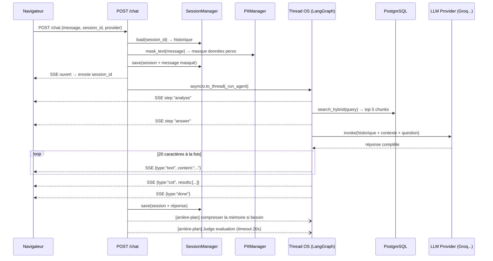

**SSE = Server-Sent Events.** Une réponse HTTP qui reste ouverte — le serveur pousse des données au fil de l'eau. C'est unidirectionnel (serveur → client uniquement). Chaque message est une ligne prefixée `data:` :

```
data: {"type": "step", "step": "analyse"}

data: {"type": "text", "content": "Bonjour"}

data: {"type": "done"}
```

**Pourquoi SSE et pas WebSocket ?** WebSocket = connexion bidirectionnelle (les deux côtés peuvent envoyer). SSE = serveur vers client seulement. Ici on n'a besoin que d'une direction, SSE est plus simple.

**Pourquoi des chunks de 20 caractères ?** Le LLM a déjà retourné TOUTE la réponse d'un coup — on la redécoupe artificiellement pour l'effet "typing" dans l'UI :

```python
chunk_size = 20
for i in range(0, len(response), chunk_size):
    yield f"data: {json.dumps({'type': 'text', 'content': response[i:i+chunk_size]})}\n\n"
    await asyncio.sleep(0.01)   # 10ms entre chaque chunk
```

---

### 1.7 `mcp_server.py` — exposer l'Oracle à des LLMs externes

**MCP = Model Context Protocol.** Standard open-source d'Anthropic. Permet à des LLMs externes (Claude Desktop, Cursor...) d'appeler nos outils via HTTP, exactement comme le frontend appelle `/chat`. La différence : c'est un LLM qui fait l'appel, pas un humain.

On expose deux outils MCP :

```python
@mcp.tool()
def search_knowledge_base(query: str, k: int = 5) -> str:
    # Recherche hybride — même logique que /chat mais sans LLM pour générer la réponse
    query_vector = _vm.embeddings_model.embed_query(clean_query)
    results = _vm.search_hybrid(...)
    # Retourne les résultats avec niveaux HIGH / MEDIUM / LOW

@mcp.tool()
def list_sources() -> str:
    # Liste les fichiers ingérés dans la base
```

Le serveur MCP est monté dans FastAPI sur `/mcp` comme une sous-app ASGI. Le `VectorManager` lui est injecté via `setup(vm)` au démarrage — il ne crée rien lui-même.

---

### 1.8 `routers/ingest.py` — ingestion via API

**Sécurité :** les routes d'ingestion exigent un header `X-API-Key`. FastAPI vérifie cela via une **dépendance** — une fonction appelée automatiquement avant la route :

```python
def _require_api_key(x_api_key: str = Header(...)):
    if x_api_key != state.ADMIN_API_KEY:
        raise HTTPException(status_code=401, detail="Clé API invalide")

@router.post("", dependencies=[Depends(_require_api_key)])  # ← vérification avant tout
async def trigger_ingest(...):
    ...
```

**Pourquoi un Thread et pas asyncio pour l'ingestion ?** L'ingestion fait trois choses lourdes avec des bibliothèques **synchrones** (elles ne savent pas faire `await`) : appel LLM pour valider, génération d'embeddings avec Ollama, écriture en base. Si on les appelait directement dans asyncio, elles bloqueraient l'event loop entière et aucune autre requête ne passerait. Un thread OS tourne en vrai parallèle, sans toucher à asyncio.

```python
t = threading.Thread(target=_run_ingestion, args=[saved_paths], daemon=True)
t.start()
return {"started": True}   # répond IMMÉDIATEMENT — l'ingestion tourne en fond
```

Le frontend poll `/ingest/status` régulièrement pour suivre l'avancement — c'est le dict `state.ingest_status` mis à jour par le thread.

**Annulation coopérative :** l'annulation ne tue pas le thread de force. Elle lève un drapeau (`threading.Event`), et le thread vérifie ce drapeau entre chaque fichier.

```python
state.ingest_cancel.set()       # lever le drapeau depuis /ingest/cancel

if state.ingest_cancel.is_set():  # dans le thread, entre chaque fichier
    return                         # s'arrête proprement
```

---

### Points à retenir (Thème 1)

| Question probable | Réponse courte |
|---|---|
| FastAPI c'est quel type d'API ? | API REST — verbes HTTP, URLs comme ressources, stateless, JSON |
| C'est quoi un middleware ? | Couche qui intercepte chaque requête avant/après la route. Ici : CORS |
| Pourquoi le CORS ? | Le navigateur bloque les requêtes cross-domaine sans ce header |
| Pourquoi asyncio ? | Traiter plusieurs requêtes en même temps sans bloquer sur les appels LLM |
| Pourquoi `to_thread` ? | LangGraph est synchrone — il bloquerait l'event loop sans thread |
| C'est quoi SSE ? | Réponse HTTP ouverte qui pousse des événements au fil de l'eau |
| Pourquoi SSE et pas WebSocket ? | SSE suffit (unidirectionnel), plus simple à implémenter |
| C'est quoi MCP ? | Protocole pour que des LLMs externes appellent nos outils via HTTP |
| Pourquoi un Thread pour l'ingestion ? | Les libs embedding/LLM sont synchrones — thread = vrai parallélisme |
| C'est quoi le couplage fort ? | Si tu changes state.vm, tu dois modifier tous les routers — dépendance directe |

---

## Thème 2 — RAG & Recherche hybride

### 2.1 Vue d'ensemble du pipeline RAG

**RAG = Retrieval-Augmented Generation.** Au lieu de laisser le LLM répondre de mémoire (ce qui peut produire des hallucinations), on lui donne des extraits du contenu pertinent trouvés dans notre base de données. Le LLM génère une réponse basée sur ces extraits.

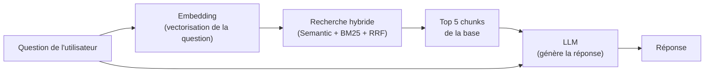

Dans notre projet, le RAG est orchestré par **LangGraph** via un agent **ReAct**.

---

### 2.2 LangGraph et le cycle ReAct

**LangGraph** est une bibliothèque qui permet de créer des agents LLM sous forme de graphe d'états. Un agent peut prendre des décisions, utiliser des outils, et itérer jusqu'à avoir une bonne réponse.

**ReAct = Reason + Act.** C'est le pattern utilisé : le LLM **raisonne** ("j'ai besoin d'info sur X"), **agit** (appelle un outil), observe le résultat, puis raisonne à nouveau. Il peut enchaîner plusieurs appels d'outils avant de répondre.

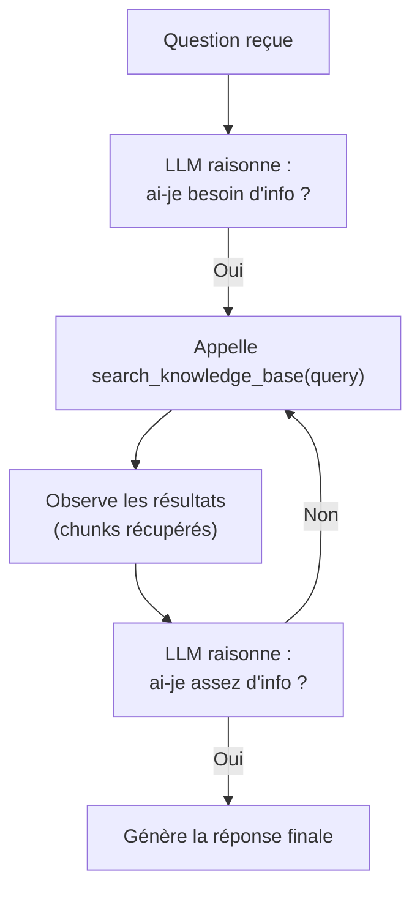

Dans notre code :

```python
# routers/chat.py — _run_agent()
agent = create_react_agent(llm, [search_tool], prompt=state.BASE_SYSTEM_PROMPT)
result = agent.invoke({"messages": lc_history})
response_text = result["messages"][-1].content
```

`create_react_agent` crée automatiquement le graphe ReAct. On lui donne le LLM et la liste des outils disponibles (`[search_tool]`). Le LLM décide lui-même quand et comment appeler l'outil.

---

### 2.3 `tools_oracle.py` — l'outil de recherche

`get_search_tool()` est une **factory** — une fonction qui crée et retourne une autre fonction (l'outil). Elle bind (attache) le VectorManager à l'outil pour qu'il puisse faire la recherche.

```python
def get_search_tool(vm, k_final=5, cot_storage=None, step_callback=None):

    @tool
    def search_knowledge_base(query: str) -> str:
        """Searches the Oracle's database..."""  # ← LangGraph lit cette docstring
        query = query.strip()[:500]             # tronque à 500 chars max
        query_vector = vm.embeddings_model.embed_query(query)  # vectorise la question
        results = vm.search_hybrid(query=query, query_vector=query_vector, k_final=k_final)
        # ...formate les résultats avec niveau de confiance
        return f"<archives_sacrees>\n{...}\n</archives_sacrees>"

    return search_knowledge_base
```

**Pourquoi `<archives_sacrees>` ?** Le LLM reçoit les résultats emballés dans ces balises XML. Le prompt système lui dit : "ce qui est dans `<archives_sacrees>` vient de ta base de données — utilise ça pour répondre." C'est une convention de prompt engineering pour délimiter clairement le contexte récupéré.

**Le CoT storage (Chain of Thought)** : `cot_storage` est une liste mutable passée par référence. L'outil y ajoute les métadonnées de chaque résultat (source, score, confiance). Ces données sont envoyées au frontend via SSE à la fin pour afficher "sources utilisées" dans l'UI.

**Les seuils de confiance :**

```python
CONFIDENCE_THRESHOLD_HIGH   = 0.025   # score RRF ≥ 0.025 → "high"
CONFIDENCE_THRESHOLD_MEDIUM = 0.010   # score RRF ≥ 0.010 → "medium"
                                       # en dessous → "low"
```

Ces valeurs sont **empiriques** — calibrées manuellement pour le modèle `paraphrase-multilingual-MiniLM-L12-v2`. Si on change de modèle d'embedding, ces seuils peuvent devenir faux.

---

### 2.4 `vector_manager.py` — les 4 types de recherche

Le VectorManager gère la connexion à PostgreSQL et implémente les recherches. Voici les 4 méthodes de recherche, du plus simple au plus complexe.

#### Recherche sémantique (`search_semantic`)

Convertit la question en vecteur, cherche les documents dont le vecteur est le plus proche (distance cosinus).

```python
def search_semantic(self, query_vector, k=10):
    cur.execute("""
        SELECT content, vecteur <=> %s::vector AS distance, metadata
        FROM documents
        ORDER BY distance
        LIMIT %s
    """, (query_vector, k))
```

`<=>` = opérateur de distance cosinus de pgvector. Retourne les K documents les plus proches dans l'espace vectoriel.

**Limite :** trouve bien les documents sémantiquement proches, mais rate les correspondances exactes de mots-clés. Ex: "Iop" (nom propre) peut être mal retrouvé si le vecteur de "Iop" n'est pas proche du vecteur de ta question.

#### Recherche BM25 (`search_bm25`)

BM25 = Best Match 25. C'est de la recherche par mots-clés avec pondération statistique. PostgreSQL l'implémente nativement via la **FTS** (Full-Text Search — recherche plein texte).

```python
def search_bm25(self, query, k=10):
    cur.execute("""
        SELECT content,
               ts_rank(fts_vector, plainto_tsquery('french', %s)) AS rank,
               metadata
        FROM documents
        WHERE fts_vector @@ plainto_tsquery('french', %s)
        ORDER BY rank DESC
        LIMIT %s
    """, (query, query, k))
```

`plainto_tsquery('french', query)` = convertit la question en requête FTS française (gestion des accents, stop-words...). `fts_vector @@ ...` = filtre les documents qui contiennent les mots. `ts_rank` = score de pertinence basé sur la fréquence des mots.

**Limite :** ne comprend pas le sens — "voiture" ne retrouve pas "automobile". Mais excellent pour les noms propres et termes exacts.

#### Recherche hybride avec RRF (`search_hybrid`)

Combine les deux pour avoir le meilleur des deux mondes.

**RRF = Reciprocal Rank Fusion.** Formule pour fusionner deux listes de résultats classées :

```
Score RRF d'un document = 1/(k + rang_semantic) + 1/(k + rang_bm25)
```

où `k = 60` (constante empirique qui atténue l'effet des premiers rangs).

```python
def search_hybrid(self, query, query_vector, k_final=5):
    semantic_results = self.search_semantic(query_vector, k=10)  # top 10 sémantique
    bm25_results = self.search_bm25(query, k=10)                  # top 10 BM25

    rrf_scores = {}
    for rank, (content, score, metadata) in enumerate(semantic_results):
        rrf_scores[content] = rrf_scores.get(content, 0.0) + 1.0 / (60 + rank + 1)

    for rank, (content, score, metadata) in enumerate(bm25_results):
        rrf_scores[content] = rrf_scores.get(content, 0.0) + 1.0 / (60 + rank + 1)

    # Trie par score RRF décroissant, garde les 5 meilleurs
    return sorted_by_rrf[:k_final]
```

**Exemple concret :**

```
Question : "Dofus Iop"

Résultats sémantique : [DocA(rang 1), DocB(rang 2), DocC(rang 3)]
Résultats BM25       : [DocB(rang 1), DocD(rang 2), DocA(rang 3)]

Score RRF DocA = 1/(60+1) + 1/(60+3) = 0.01639 + 0.01563 = 0.03202
Score RRF DocB = 1/(60+2) + 1/(60+1) = 0.01613 + 0.01639 = 0.03252
→ DocB gagne car il était dans les deux listes
```

Un document qui apparaît dans les **deux** listes monte forcément dans le classement final — même s'il n'était pas premier dans chacune.

#### `search_similar` — code mort

```python
def search_similar(self, query_vector, k=K_FINAL):
    """Alias for search_semantic() — kept for backward compatibility."""
    return self.search_semantic(query_vector, k)
```

Cette méthode est un alias inutile. Elle n'est appelée nulle part dans le code actuel. Vestige d'une ancienne version.

---

### 2.5 Déduplication des chunks

Avant d'insérer un chunk, on calcule son hash SHA-256 :

```python
chunk_hash = hashlib.sha256(text.encode()).hexdigest()

INSERT INTO documents (content, vecteur, metadata, ingested_at, chunk_hash)
VALUES (...)
ON CONFLICT (chunk_hash) WHERE (chunk_hash IS NOT NULL) DO NOTHING
```

Si le même texte est réingéré, le hash est identique → PostgreSQL ignore l'insertion. Ça évite les doublons sans avoir à vérifier manuellement.

---

### 2.6 Enrichissement du texte avant embedding

Avant de vectoriser un chunk, on lui ajoute du contexte selon les métadonnées disponibles :

```python
if "global_context" in metadata:
    text_to_embed = f"Global Context: {metadata['global_context']}\n\nContent: {text}"
elif "Header 1" in metadata:
    text_to_embed = f"Chapter: {metadata['Header 1']}\n\nContent: {text}"
elif "category" in metadata and "item_name" in metadata:
    text_to_embed = f"Category: {metadata['category']} | Item: {metadata['item_name']}\n\nContent: {text}"
```

**Pourquoi ?** Un chunk isolé "Les Iops sont des guerriers" a un vecteur plus précis si on le vectorise avec son contexte "Chapitre: Classes de personnages — Les Iops sont des guerriers". Le vecteur capture alors le sujet global + le contenu local.

---

### Points à retenir (Thème 2)

| Question probable | Réponse courte |
|---|---|
| C'est quoi RAG ? | Retrieval-Augmented Generation — on donne des extraits de la base au LLM avant qu'il réponde |
| C'est quoi ReAct ? | Reason + Act — le LLM décide quand appeler l'outil, peut enchaîner plusieurs appels |
| Pourquoi la recherche hybride ? | Sémantique rate les noms propres, BM25 rate le sens — la fusion donne le meilleur des deux |
| C'est quoi RRF ? | Formule de fusion de deux classements : 1/(k+rang). Un doc dans les deux listes monte |
| Pourquoi `<archives_sacrees>` ? | Balise XML pour que le LLM identifie clairement le contexte récupéré dans son prompt |
| C'est quoi le CoT storage ? | Liste mutable où l'outil stocke les sources utilisées → envoyées au frontend via SSE |
| Les seuils 0.025 / 0.010 c'est quoi ? | Seuils empiriques pour classer HIGH/MEDIUM/LOW — calibrés pour un modèle spécifique |
| C'est quoi `search_similar` ? | Alias mort de `search_semantic`, gardé pour rétrocompatibilité, jamais appelé |

---

## Thème 3 — Contexte & Mémoire

### 3.1 Le problème des conversations longues

Les LLMs ont une **fenêtre de contexte** limitée (ex: 8 000 tokens pour llama-3). Si tu envoies tout l'historique de la conversation à chaque message, tu dépasses rapidement cette limite. Il faut gérer ça intelligemment.

Notre solution : **Summary-Buffer Memory** — on garde les N derniers messages intacts et on résume le reste.

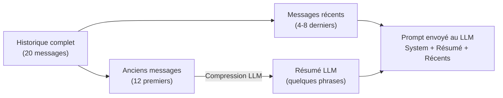

---

### 3.2 `memory_manager.py` — la compression de mémoire

**Estimation des tokens :** comme on ne veut pas appeler un tokenizer lourd juste pour compter, on utilise une approximation : 1 token ≈ 3 caractères.

```python
def _estimate_tokens(text: str) -> int:
    return max(1, len(text) // 3)
```

C'est volontairement conservateur (surestime) pour éviter de dépasser la limite réelle.

**Quand compresse-t-on ?** On vérifie si la fenêtre de messages récents dépasse le budget de tokens :

```python
def needs_summarization(self, messages, current_summary):
    recent = self._get_recent_window(messages)
    tokens_messages = sum(len(m["content"]) // 3 for m in recent)
    tokens_summary  = len(current_summary) // 3

    overhead = 500 + (300 * max(1, len(recent) // 2))  # estimation de l'overhead système
    total = tokens_messages + tokens_summary + overhead

    return total > self.max_recent_tokens   # max_recent_tokens = 1200 par défaut
```

**Comment la compression fonctionne :**

```python
def compress(self, session, llm):
    messages = session["messages"]            # ex: 20 messages
    recent   = self._get_recent_window(messages)  # garde les 4-8 derniers
    to_summarize = messages[:len(messages) - len(recent)]  # le reste à résumer

    new_summary = summarize_messages(to_summarize, session["summary"], llm)
    # → appelle le LLM avec : résumé existant + nouveaux messages à résumer

    session["summary"]  = new_summary  # remplace par le nouveau résumé
    session["messages"] = recent       # garde seulement les récents
    return session
```

**La compression est lancée en arrière-plan** après la réponse — pas pendant, pour ne pas ralentir l'expérience utilisateur :

```python
# routers/chat.py — APRÈS avoir envoyé la réponse via SSE
if state.mm.needs_summarization(session["messages"], session.get("summary", "")):
    asyncio.create_task(_compress_session())   # tâche asyncio non bloquante
```

---

### 3.3 `session_manager.py` — le stockage des sessions

Le SessionManager détecte automatiquement l'environnement et choisit le bon backend de stockage :

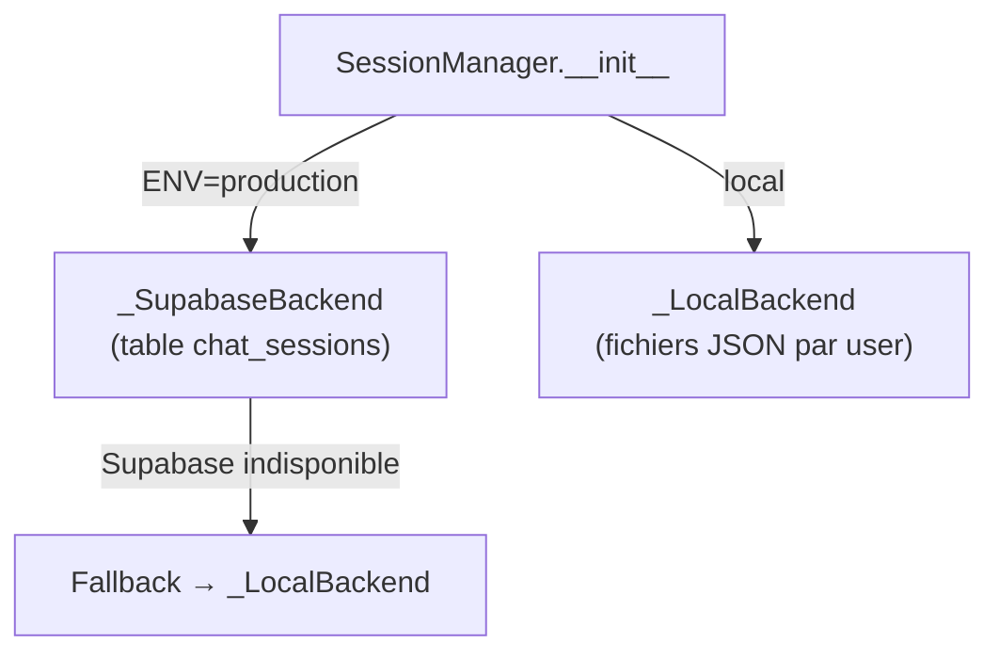

**Backend local :** un fichier JSON par session, dans `STORAGE_DIR/{user_id}/{session_id}.json`.

```python
# Exemple de fichier de session local
{
  "session_id": "abc-123",
  "user_id": "local_dev",
  "title": "Comment fonctionne l'Iop ?",
  "messages": [
    {"role": "user", "content": "Comment fonctionne l'Iop ?"},
    {"role": "assistant", "content": "L'Iop est une classe..."}
  ],
  "summary": "",
  "provider": "groq",
  "model": "llama-3.3-70b-versatile"
}
```

**Backend Supabase :** même structure mais dans une table PostgreSQL `chat_sessions`. L'`upsert` PostgreSQL gère à la fois création et mise à jour en une seule requête.

**Auto-titre de la session :** le titre est généré à partir du **premier message utilisateur**, tronqué à 60 caractères :

```python
def _make_title(first_user_message: str) -> str:
    title = first_user_message.strip().replace("\n", " ")
    return title[:60] + "…" if len(title) > 60 else title
```

Ce titre est assigné lors du premier `save()` — tant que le titre est "New conversation" et qu'il y a un premier message, on le remplace.

**Gestion des guests :** si l'utilisateur n'a pas d'UUID valide (pas connecté), il est limité à 5 messages :

```python
# routers/chat.py
if not req.user_id or not state.is_valid_uuid(req.user_id):
    guest_msgs = [m for m in session.get("messages", []) if m["role"] == "user"]
    if len(guest_msgs) >= 5:
        raise HTTPException(status_code=429, detail="Limite de 5 messages atteinte.")
```

---

### Points à retenir (Thème 3)

| Question probable | Réponse courte |
|---|---|
| Pourquoi gérer la mémoire ? | Les LLMs ont une fenêtre de contexte limitée — l'historique complet la dépasserait |
| C'est quoi Summary-Buffer Memory ? | On garde les N derniers messages intacts et on résume les anciens avec un LLM |
| Quand la compression se déclenche-t-elle ? | Après avoir envoyé la réponse, en arrière-plan, si le budget tokens est dépassé |
| Pourquoi 1 token ≈ 3 chars ? | Approximation conservative pour éviter d'appeler un tokenizer lourd |
| Comment le backend est-il choisi ? | Variable d'env `ENV=production` → Supabase, sinon → fichiers JSON locaux |
| C'est quoi l'upsert ? | INSERT + UPDATE en une seule requête SQL — crée si n'existe pas, met à jour si existe |

---

## Thème 4 — Pipeline d'ingestion

### 4.1 Vue d'ensemble

L'ingestion = transformer un fichier brut en vecteurs dans PostgreSQL, en passant par 4 étapes.

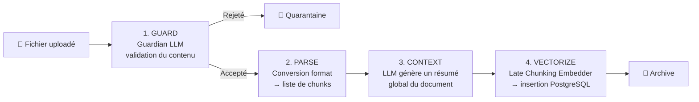

---

### 4.2 `guardian.py` — la validation par LLM

Avant d'ingérer, on vérifie que le fichier contient bien du contenu lié à Dofus/MMORPG. On envoie un échantillon de 1 500 caractères à un LLM léger (llama-3.1-8b par défaut, configuré dans le fichier de config).

```python
def is_valid_lore_file(file_path: str) -> tuple[bool, str]:
    # 1. Extrait 1500 chars du fichier (PDF ou texte)
    sample_text = file.read(1500)

    # 2. Instancie le LLM configuré dans [guardian] du config
    llm = get_llm(provider_key="groq", model="llama-3.1-8b-instant", config=config)

    # 3. Envoie le prompt : "Ce fichier est-il du lore Dofus ? OUI/NON + explication"
    response = llm.invoke(prompt.format(sample_text=sample_text))

    # 4. Parse la réponse : première ligne = OUI ou NON
    verdict = response.content.strip().splitlines()[0].upper().startswith("OUI")
    return verdict, explication
```

**Si le LLM est indisponible :** au lieu de silently accepter, le Guardian lève une `RuntimeError` qui arrête toute l'ingestion. On préfère bloquer plutôt qu'accepter du contenu non validé.

**Cas particulier des PDFs scannés :** si le PDF ne contient aucun texte extractible (images uniquement, pas d'OCR), il est rejeté directement sans appel LLM.

---

### 4.3 Les converters — de fichier à chunks

Chaque format a son propre convertisseur qui retourne une liste de tuples `(texte, métadonnées)`.

| Format | Convertisseur | Mécanisme |
|---|---|---|
| `.csv` | `convert_csv.py` | Regroupe les lignes par batch de 20, sérialise en JSON |
| `.json` | `convert_json.py` | Parcourt la structure, regroupe par catégorie |
| `.txt` | `convert_text.py` | SentenceSplitter de LlamaIndex (512 tokens, overlap 50) |
| `.md` | `convert_markdown.py` | MarkdownNodeParser → extrait la hiérarchie des headers |
| `.pdf` | `convert_pdf.py` | SimpleDirectoryReader de LlamaIndex + SentenceSplitter |
| autres | `convert_unstructured.py` | API Unstructured.io (DOCX, PPTX...) |

**SentenceSplitter** (LlamaIndex) : découpe le texte en chunks de 512 tokens maximum avec un overlap (chevauchement) de 50 tokens. L'overlap garantit que le contexte de fin d'un chunk est répété au début du suivant — aucune phrase ne sera coupée sans contexte.

```
Chunk 1: [tokens 1-512]
Chunk 2: [tokens 463-974]   ← les 50 derniers tokens du chunk 1 se répètent
Chunk 3: [tokens 925-1436]
```

**Exemple concret pour Markdown :**

```markdown
# Classe Iop
## Description
L'Iop est une classe de guerrier...
## Sorts
Le sort Epée Divine inflige...
```

Résultat :
```python
[
  ("L'Iop est une classe de guerrier...", {"Header 1": "Classe Iop", "Header 2": "Description", "source": "classes.md"}),
  ("Le sort Epée Divine inflige...",      {"Header 1": "Classe Iop", "Header 2": "Sorts", "source": "classes.md"}),
]
```

Les métadonnées de headers permettent d'enrichir le vecteur (voir 2.6) et de filtrer les résultats par section si besoin.

---

### 4.4 `late_chunking.py` — l'embedding contextuel

**Le problème de l'embedding naïf :** si tu vectorises chaque chunk de façon isolée, le chunk "Il réside à Bonta" (sans contexte) ne sait pas de qui on parle. Son vecteur est peu précis.

**Late Chunking :** avant d'embedder chaque chunk, on lui **préfixe** les 3 chunks précédents comme contexte.

```python
_CONTEXT_WINDOW = 3

def embed_chunks(self, chunks):
    contextual_texts = []
    for i, chunk in enumerate(chunks):
        start = max(0, i - self.context_window)   # 3 chunks précédents
        context_parts = chunks[start:i]
        if context_parts:
            text = f"Context: {' '.join(context_parts)}\n\nChunk: {chunk}"
        else:
            text = chunk
        contextual_texts.append(text[:3000])   # limite à 3000 chars

    return self.embeddings.embed_documents(contextual_texts)
```

**Exemple :**
```
Chunk 0 : "L'Iop est un guerrier."
Chunk 1 : "Il utilise la force brute."
Chunk 2 : "Il réside à Bonta."
Chunk 3 : "Son sort principal est Epée Divine."

→ Pour embedder le chunk 3, on envoie :
"Context: L'Iop est un guerrier. Il utilise la force brute. Il réside à Bonta.

Chunk: Son sort principal est Epée Divine."
```

Le vecteur du chunk 3 capture maintenant qu'on parle de l'Iop de Bonta — bien meilleure précision.

> **Note technique :** c'est appelé "Poor man's late chunking" dans la review Gemini. Le vrai late chunking fait du token pooling au niveau du modèle. Ici on fait une approximation textuelle, mais le résultat est bon en pratique.

---

### 4.5 `pii_manager.py` — masquage des données personnelles

**PII = Personally Identifiable Information** (données personnelles identifiables). Avant de stocker ou d'envoyer un message à un LLM, on masque les données sensibles.

Deux étapes :

**Étape 1 — Regex** (expressions régulières) pour les formats structurés :

```python
patterns = {
    "[EMAIL]":   r"\b[A-Za-z0-9._%+-]+@[A-Za-z0-9.-]+\.[A-Z|a-z]{2,}\b",
    "[PHONE]":   r"\b(?:\+?\d{1,3})?[-.]?\(?\d{2,4}\)?[-.\s]?\d{2,4}[-.\s]?\d{2,4}\b",
    "[IP_ADDR]": r"\b\d{1,3}\.\d{1,3}\.\d{1,3}\.\d{1,3}\b",
}
# "Mon email est test@gmail.com" → "Mon email est [EMAIL]"
```

**Étape 2 — Spacy NER** (Named Entity Recognition — reconnaissance d'entités nommées) pour les entités non structurées :

```python
doc = nlp_model(masked_text)
for ent in doc.ents:
    if ent.label_ == "PER":   # personne
        replace(ent.text, "[PERSON]")
    elif ent.label_ == "LOC": # lieu
        replace(ent.text, "[LOCATION]")
    elif ent.label_ == "ORG": # organisation
        replace(ent.text, "[ORG]")
# "Arnaud travaille chez HELMo" → "[PERSON] travaille chez [ORG]"
```

**Pattern Singleton :** le modèle Spacy (200 MB) est chargé une seule fois en variable de classe `_nlp_model`. Tous les objets `PIIManager` partagent la même instance — on ne recharge pas le modèle à chaque appel.

**Problème connu :** si le modèle `fr_core_news_sm` n'est pas installé, Spacy le télécharge automatiquement au runtime — ça peut bloquer l'API plusieurs secondes au premier appel.

---

### 4.6 `judge.py` — l'évaluation de la qualité RAG

Après chaque réponse, un LLM "Judge" évalue la qualité sur 4 dimensions (note de 1 à 5) :

```python
# Scores évalués par le Judge
{
    "context_relevance": 4,  # Les chunks récupérés étaient-ils pertinents ?
    "faithfulness": 5,       # La réponse respecte-t-elle les chunks (pas d'hallucination) ?
    "answer_relevance": 4,   # La réponse répond-elle à la question ?
    "context_coverage": 3,   # Les chunks couvraient-ils suffisamment le sujet ?
}
```

Ces scores sont logués en base (table `logs`) pour analyse qualité. Le Judge tourne en **arrière-plan avec un timeout de 20 secondes** — si ça plante ou dépasse le timeout, ça ne dérange pas l'utilisateur.

**Problème de parsing fragile :** le LLM retourne du JSON, parfois emballé dans des balises Markdown :

```
```json
{"context_relevance": 4, ...}
```
```

Le code fait un nettoyage manuel avec `strip()` sur les balises ` ``` `. C'est fragile — si le LLM change légèrement son format de réponse, le parsing plante. La solution recommandée : utiliser `instructor` ou `Pydantic` pour forcer une sortie structurée.

---

### Points à retenir (Thème 4)

| Question probable | Réponse courte |
|---|---|
| C'est quoi le Guardian ? | LLM léger qui valide si un fichier contient du lore Dofus avant ingestion |
| Pourquoi 1 500 chars d'échantillon ? | Limiter le coût API — pas besoin du fichier entier pour valider le contenu |
| C'est quoi le late chunking ? | Préfixer les 3 chunks précédents avant d'embedder → vecteur avec contexte |
| Pourquoi un overlap de 50 tokens ? | Eviter de couper le contexte entre deux chunks — fin d'un chunk = début du suivant |
| C'est quoi PII ? | Données personnelles (email, téléphone, nom) — masquées avant envoi au LLM |
| Pourquoi Regex + Spacy ? | Regex pour les formats structurés (email, IP), Spacy pour les noms propres |
| C'est quoi le Judge ? | LLM qui évalue la qualité de chaque réponse RAG sur 4 critères — s'exécute en fond |
| Problème du Judge ? | Parsing JSON fragile — dépend du format de sortie du LLM, peut casser |

---

## Thème 5 — Providers LLM

### 5.1 L'abstraction multi-provider

Le projet supporte 4 fournisseurs de LLM : Groq, OpenAI, Anthropic, Google Gemini. Pour que le reste du code ne soit pas couplé à un provider spécifique, on utilise le **pattern Abstract Factory**.

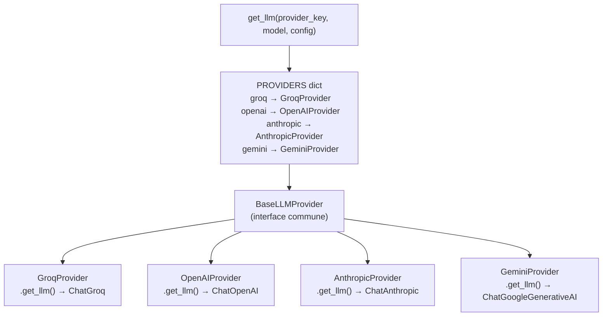

**Tous les providers retournent un objet compatible LangChain.** Le reste du code appelle `.invoke()` sur cet objet sans savoir quel provider est derrière. Si demain on ajoute Mistral, on crée un `MistralProvider` sans toucher au reste.

```python
# providers/__init__.py
def get_llm(provider_key: str, model: str, config: dict) -> Any:
    _, provider_cls = PROVIDERS[provider_key]     # ex: GroqProvider
    api_key = os.environ.get(env_map[provider_key])
    temperature = config.get("llm", {}).get("temperature", 0.0)
    return provider_cls(model=model, temperature=temperature, api_key=api_key).get_llm()
```

**Problème de maintenabilité :** la liste des clés d'API (`env_map`) est hardcodée dans `providers/__init__.py`. Si on renomme une variable d'env, il faut modifier ce fichier. La solution serait de mettre ça dans le fichier de config YAML.

---

### 5.2 `error_handler.py` — la classification des erreurs

Quand un LLM provider plante, l'exception brute ressemble à :

```
groq.APIStatusError: Error code: 429 - {'error': {'message': 'Rate limit reached...'}}
```

Ce n'est pas affichable à l'utilisateur. Le `error_handler.py` intercepte ces exceptions et les convertit en messages lisibles.

**Pattern de classification :** inspection du message d'erreur par mots-clés :

```python
def _classify(error: Exception, provider: str) -> ErrorType:
    msg = str(error).lower()

    if any(k in msg for k in ["quota", "billing", "credit", "402"]):
        return ErrorType.QUOTA_EXCEEDED

    if any(k in msg for k in ["rate_limit", "429", "too many requests"]):
        return ErrorType.RATE_LIMITED

    if any(k in msg for k in ["invalid api key", "401", "authentication"]):
        return ErrorType.INVALID_KEY
    # ...
```

Chaque `ErrorType` a un message UI associé avec icône, titre, description et suggestion :

```python
# Ce que voit l'utilisateur pour RATE_LIMITED :
{
    "icon": "⏳",
    "title": "Too many requests",
    "message": "The Oracle is being consulted too frequently.",
    "suggestion": "Wait a few seconds and try again.",
}
```

> **Limite :** la classification par mots-clés est fragile — si Groq change le format de ses messages d'erreur, la classification peut tomber sur `UNKNOWN`. Une approche plus robuste serait d'intercepter les types d'exceptions directement (ex: `groq.RateLimitError`).

---

### 5.3 Les hyperparamètres clés

Ce sont des valeurs numériques choisies empiriquement (par expérimentation, pas par calcul théorique). Elles impactent directement la qualité des réponses.

| Paramètre | Valeur | Fichier | Impact si on le change |
|---|---|---|---|
| `K_SEMANTIC` | 10 | `utils.py` | Nb de résultats sémantiques récupérés. Plus élevé = plus de rappel, plus lent |
| `K_BM25` | 10 | `utils.py` | Idem pour BM25 |
| `K_FINAL` | 5 | `utils.py` | Chunks envoyés au LLM. Plus élevé = plus de contexte mais risque de dépasser la fenêtre LLM |
| `RRF_K` | 60 | `utils.py` | Constante RRF. Plus élevé = les différences de rang comptent moins |
| `CONFIDENCE_THRESHOLD_HIGH` | 0.025 | `tools_oracle.py` | Seuil pour label "high" — calibré pour un modèle spécifique |
| `CONFIDENCE_THRESHOLD_MEDIUM` | 0.010 | `tools_oracle.py` | Seuil pour label "medium" |
| `_CONTEXT_WINDOW` | 3 | `late_chunking.py` | Nb de chunks précédents comme contexte. Plus élevé = meilleur contexte mais texte plus long |
| `max_recent_tokens` | 1200 | `memory_manager.py` | Budget tokens pour la fenêtre de messages récents |
| `temperature` | 0.0 | `utils.py` | 0 = déterministe (même réponse à chaque fois). 1 = créatif/aléatoire |
| chunk size | 512 tokens | converters | Taille des chunks. Trop petit = perd le contexte. Trop grand = moins précis |
| chunk overlap | 50 tokens | converters | Chevauchement entre chunks pour ne pas perdre le contexte en frontière |

---

### Points à retenir (Thème 5)

| Question probable | Réponse courte |
|---|---|
| Pourquoi une abstraction multi-provider ? | Pour changer de LLM sans toucher au reste du code — couplage faible |
| C'est quoi le pattern utilisé ? | Abstract Factory — interface commune, implémentations différentes |
| Pourquoi temperature = 0.0 ? | Réponses déterministes — le LLM ne "s'invente" pas de variations |
| Les seuils 0.025 sont calibrés comment ? | Empiriquement — testés à la main avec le modèle d'embedding actuel |
| Problème de l'error_handler ? | Classification par mots-clés fragile — peut tomber sur UNKNOWN si le provider change son format |

---

## Thème 6 — Tests

### 6.1 Ce qui est testé

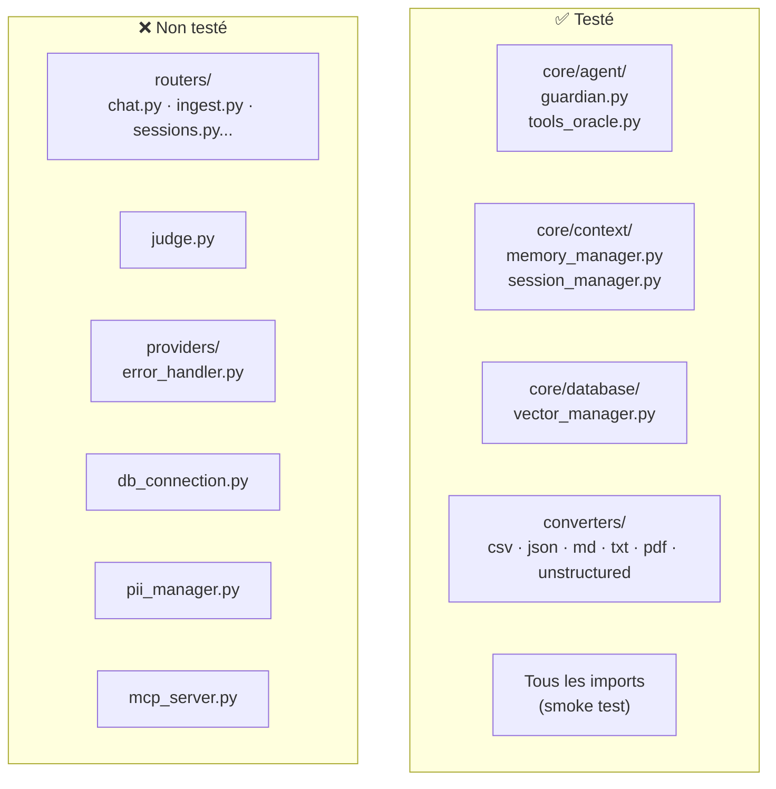

---

### 6.2 Types de tests utilisés

**Tests unitaires avec mocks :** on remplace les vraies dépendances (base de données, LLM, fichiers) par des faux objets contrôlables (`MagicMock`). Ça permet de tester la logique sans connexion réseau.

```python
# test_database.py — on mocke psycopg et OllamaEmbeddings
@patch('core.database.vector_manager.psycopg.connect')
@patch('core.database.vector_manager.OllamaEmbeddings')
def setUp(self, mock_embedding, mock_connect):
    self.manager = VectorManager()   # crée un VectorManager avec de fausses connexions
```

**Tests avec vrais fichiers temporaires (intégration partielle) :**

```python
# test_converters.py — crée un vrai fichier CSV temporaire
def create_temp_file(content, suffix):
    with tempfile.NamedTemporaryFile(mode="w", delete=False, suffix=suffix) as tmp:
        tmp.write(content)
        return tmp.name

def test_load_csv_nominal(self):
    tmp_path = create_temp_file("name,age\nAlice,30\nBob,25", ".csv")
    result = load_csv_data(tmp_path)
    self.assertEqual(len(result), 1)   # 2 lignes < 20 → 1 seul chunk
```

---

### 6.3 Bug repéré dans les tests

`test_agent.py` — `TestGuardian.test_pdf_auto_accept` :

```python
def test_pdf_auto_accept(self, mock_splitext):
    mock_splitext.return_value = ('mon_fichier', '.pdf')
    self.assertTrue(is_valid_lore_file("test.pdf"))   # ← attend un bool
```

Mais `is_valid_lore_file` retourne un **tuple** `(bool, str)` :

```python
# guardian.py
return False, "Unreadable PDF (no text extracted)."   # tuple, pas bool !
```

`assertTrue((False, "message"))` → passe toujours à True (un tuple non-vide est truthy en Python). Ce test ne teste pas ce qu'il prétend tester.

---

### 6.4 Ce qui manque

| Ce qui n'est pas testé | Pourquoi c'est important |
|---|---|
| Endpoints REST (routers/) | Le chemin le plus emprunté n'est pas couvert — bugs d'intégration possibles |
| `error_handler.py` | La classification des erreurs pourrait retourner `UNKNOWN` pour des erreurs connues |
| `pii_manager.py` | Le masquage PII est une feature de sécurité — les bugs ne se voient pas |
| `judge.py` | Le parsing JSON fragile n'est pas testé — peut planter silencieusement |
| `mcp_server.py` | Protocole externe non testé |

---

### Points à retenir (Thème 6)

| Question probable | Réponse courte |
|---|---|
| Les tests couvrent tout ? | Non — les routers, le Judge, les providers et le PIIManager ne sont pas testés |
| C'est quoi un mock ? | Un faux objet qui simule le comportement d'une vraie dépendance (DB, LLM) |
| Pourquoi mocker la base de données ? | Pour tester la logique sans avoir besoin d'une vraie connexion PostgreSQL |
| Il y a un bug dans les tests ? | Oui — `test_pdf_auto_accept` teste un bool mais `is_valid_lore_file` retourne un tuple |
| C'est quoi un smoke test ? | Test minimal qui vérifie juste que les imports ne plantent pas |

---

## Thème 7 — Code mort & Maintenabilité

### 7.1 Code mort identifié

| Element | Fichier | Pourquoi c'est mort |
|---|---|---|
| `search_similar()` | `vector_manager.py` | Alias de `search_semantic()` jamais appelé dans le code |
| `ingestion_worker.py` | `core/pipeline/` | Pipeline d'ingestion dupliqué — la vraie ingestion est dans `routers/ingest.py` |
| `preprocess.py` (`QuestionProcessor`) | `core/pipeline/` | Instancie un embedder mais n'est jamais appelé dans les pipelines |
| `state.py` | (absent du repo) | Généré au runtime — rupture de traçabilité dans git |

---

### 7.2 Problèmes de maintenabilité

**Imports circulaires résolus par imports locaux :**

```python
# ingestion.py — import à l'intérieur de la fonction pour éviter les imports circulaires
def generate_document_context(...):
    from providers import get_llm   # ← import local, pas en haut du fichier
```

C'est un signe que l'architecture a des dépendances circulaires (A importe B qui importe A). La solution propre serait d'injecter les dépendances en paramètre plutôt que de les importer.

**Connexion DB globale non thread-safe :**

```python
# logger.py
_shared_db_conn = None   # variable globale
_db_lock = threading.Lock()

def log_to_db_sync(level, source, message, metadata, user_id):
    global _shared_db_conn
    with _db_lock:   # ← verrou pour l'accès concurrent
        # ... utilise _shared_db_conn
```

Le verrou (`threading.Lock`) protège contre les accès simultanés depuis plusieurs threads, mais c'est une solution fragile. Si la connexion se coupe et que deux threads tentent de se reconnecter en même temps, il y a un risque de race condition. La solution propre : `psycopg_pool` (pool de connexions).

**Insertion SQL en boucle :**

```python
# vector_manager.py — add_documents_batch
cur.executemany(
    "INSERT INTO documents (...) VALUES (...)",
    params   # liste de N tuples
)
```

`executemany` envoie N requêtes SQL séparées. Pour de très grands volumes, la commande `COPY` de PostgreSQL serait 10-100x plus rapide (envoi en un seul batch binaire). Pour notre volume actuel, c'est acceptable.

**Requête non indexée :**

```python
# vector_manager.py — list_sources()
SELECT metadata->>'source' AS source, COUNT(*) ...
FROM documents
GROUP BY metadata->>'source'
```

`metadata` est une colonne JSONB. Extraire `metadata->>'source'` et faire un `GROUP BY` dessus sans index = scan complet de la table à chaque appel. Sur une grande base, cette requête sera lente. La solution : créer un index fonctionnel sur `(metadata->>'source')`.

---

### 7.3 Le verdict maintenabilité

| Pilier | Verdict | Justification |
|---|---|---|
| **Lisibilité** | ✅ Bon | Noms clairs, docstrings, code commenté en anglais |
| **Structure** | ✅ Bon | Séparation en modules (agent, pipeline, context, database) cohérente |
| **Couplage** | ⚠️ Moyen | `state.py` global crée un couplage fort entre tous les routers |
| **Tests** | ⚠️ Moyen | Bonne couverture sur la logique métier, manquante sur les routers |
| **Performance** | ⚠️ Moyen | Insertions en boucle, requête JSONB non indexée |
| **Sécurité** | ⚠️ Moyen | Bypass DNS rebinding dans le middleware, Spacy téléchargé au runtime |
| **Duplication** | ❌ Problème | Logique d'ingestion dupliquée entre `ingest.py` router et `ingestion_worker.py` |
| **Imports** | ❌ Problème | Imports circulaires résolus par imports locaux — fragile à refactorer |

---

### Points à retenir (Thème 7)

| Question probable | Réponse courte |
|---|---|
| Le code est maintenable ? | Partiellement — bonne structure mais couplage fort via state.py et duplication d'ingestion |
| C'est quoi du code mort ? | Code présent dans le repo mais jamais exécuté (search_similar, QuestionProcessor) |
| C'est quoi un import circulaire ? | A importe B qui importe A — résolu par des imports locaux, signe d'un problème d'architecture |
| Quel est le plus gros problème de perf ? | Requête JSONB sans index dans list_sources() — scan complet de table |
| Qu'est-ce qu'un pool de connexions ? | Ensemble de connexions DB pré-ouvertes réutilisables — évite d'ouvrir/fermer à chaque requête |

---

## Thème 8 — Frontend (Next.js)

### 8.1 Vue d'ensemble

Le frontend est une application **Next.js 16** avec le **App Router** (le système de routing introduit dans Next.js 13, basé sur les dossiers plutôt que sur `pages/`). Elle est déployée sur Vercel.

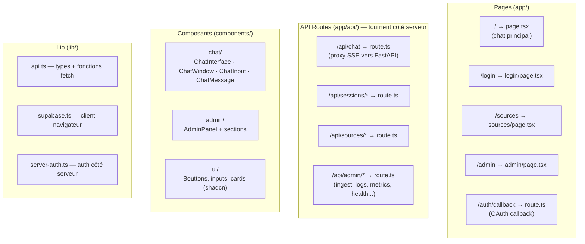

**Pourquoi des API Routes dans Next.js si on a déjà une API FastAPI ?** Les API Routes tournent sur les serveurs Vercel (côté serveur Node.js). Elles servent de **proxy** : le navigateur appelle `/api/chat` (même domaine → pas de problème CORS), et c'est le serveur Next.js qui appelle le vrai backend FastAPI. Ça permet aussi d'injecter l'authentification côté serveur avant de transmettre la requête.

---

### 8.2 Le routing Next.js App Router

Dans l'App Router, la structure des dossiers **est** le routing :

```
app/
  page.tsx              → GET /
  login/
    page.tsx            → GET /login
  sources/
    page.tsx            → GET /sources
  admin/
    page.tsx            → GET /admin
  api/
    chat/
      route.ts          → POST /api/chat
    sessions/
      route.ts          → GET/POST /api/sessions
      [id]/
        route.ts        → GET/PATCH/DELETE /api/sessions/abc-123
    auth/
      callback/
        route.ts        → GET /auth/callback
```

`[id]` dans le nom de dossier = **paramètre dynamique**. Next.js le capture automatiquement et le passe à la fonction en `params.id`.

**`"use client"` vs Server Component :** par défaut dans l'App Router, tous les composants sont des **Server Components** — ils s'exécutent uniquement côté serveur, ne peuvent pas utiliser `useState`, `useEffect`, ni les événements navigateur. Pour un composant interactif, on ajoute `"use client"` en haut du fichier.

```tsx
// ChatWindow.tsx — composant interactif, a besoin du navigateur
"use client";
import { useState, useEffect } from "react";
```

```tsx
// page.tsx — Server Component, pas de "use client"
import { ChatInterface } from "@/components/chat/ChatInterface";
export default function HomePage() {
  return <ChatInterface />;   // ChatInterface est "use client" → rendu côté client
}
```

---

### 8.3 `app/api/chat/route.ts` — le proxy SSE

C'est la pièce la plus technique du frontend. Son rôle : recevoir la requête du navigateur, la transmettre à FastAPI, et **transformer le format SSE FastAPI** en **AI SDK Data Stream Protocol** que le hook `useChat` comprend.

**Pourquoi transformer le format ?** Le hook `useChat` de Vercel AI SDK s'attend à un protocole précis pour les streams. FastAPI envoie ses propres événements JSON. Il faut donc traduire.

```
FastAPI → { type: "text", content: "Bon" }
AI SDK  → 0:"Bon"\n                          (préfixe 0: = token de texte)

FastAPI → { type: "step", step: "analyse" }
AI SDK  → 2:[{"pipelineStep":"analyse"}]\n   (préfixe 2: = annotation de données)

FastAPI → { type: "cot", results: [...] }
AI SDK  → 2:[{"cotResults":[...]}]\n         (préfixe 2: = annotation de données)

FastAPI → { type: "done" }
AI SDK  → d:{"finishReason":"stop",...}\n    (préfixe d: = fin de stream)
```

Le code lit le stream FastAPI ligne par ligne et retraduit chaque événement :

```typescript
// app/api/chat/route.ts
const stream = new ReadableStream({
  async start(controller) {
    const reader = backendResponse.body.getReader();
    // ...lit buffer ligne par ligne
    for (const line of lines) {
      if (!line.startsWith("data: ")) continue;
      const event = JSON.parse(line.slice(6));

      if (event.type === "text") {
        controller.enqueue(enc.encode(`0:${JSON.stringify(event.content)}\n`));
      } else if (event.type === "step") {
        controller.enqueue(enc.encode(`2:${JSON.stringify([{ pipelineStep: event.step }])}\n`));
      }
      // ...
    }
  }
});
```

**`export const runtime = "nodejs"`** : force l'exécution sur Node.js et non sur l'Edge Runtime de Vercel. L'Edge Runtime est plus rapide mais ne supporte pas toutes les APIs Node.js. Ici on a besoin de streams de longue durée → Node.js.

---

### 8.4 `useChat` — le hook Vercel AI SDK

`useChat` est le hook central du frontend. Il gère tout l'état du chat : envoyer les messages, lire le stream, mettre à jour les messages en temps réel.

```tsx
// ChatWindow.tsx
const { messages, input, handleInputChange, handleSubmit, isLoading, data, append } = useChat({
  id: sessionId || "new_session",
  api: "/api/chat",                              // notre API Route proxy
  body: { session_id: sessionId, ...getOracleConfig() },  // body ajouté à chaque requête
  onResponse: (res) => {
    const newId = res.headers.get("X-Session-Id");  // récupère l'ID de session créée
    if (newId && !currentSessionRef.current) {
      onSessionCreated(newId);                       // remonte l'ID au parent
    }
  },
  onError: (err) => {
    if (err.message.includes("429")) setLimitReached(true);  // guest limit
  },
});
```

**`data`** : tableau des **annotations** envoyées via le préfixe `2:`. C'est là qu'arrivent les `pipelineStep` et `cotResults`. Le composant les lit dans un `useEffect` :

```tsx
useEffect(() => {
  if (!data?.length) return;
  const lastCot = [...data].reverse().find((d: any) => d?.cotResults);
  if (lastCot) setCotResults(lastCot.cotResults);

  const lastStep = [...data].reverse().find((d: any) => d?.pipelineStep);
  if (lastStep) {
    const idx = STEP_IDS.indexOf(lastStep.pipelineStep);
    setCompletedSteps(STEP_IDS.slice(0, idx + 1));  // accumule les étapes dans l'ordre
  }
}, [data]);
```

**Config depuis `localStorage`** : le provider, le modèle, la température et `k_final` sont stockés dans `localStorage` (sauvegardés depuis le panel admin). `getOracleConfig()` les lit à chaque envoi. Pas de state React — la config est lue au moment du submit.

---

### 8.5 Authentification — Supabase Auth + Middleware

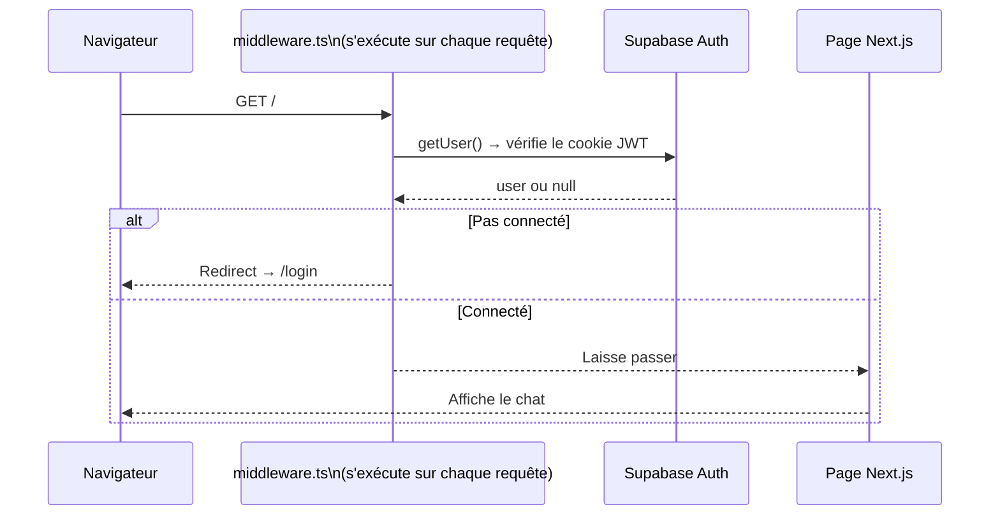

**`middleware.ts`** s'exécute sur **chaque requête** avant que la page ne se charge. Il vérifie si l'utilisateur a un cookie de session Supabase valide.

```typescript
// middleware.ts
export async function middleware(request: NextRequest) {
  if (LOCAL_MODE) return NextResponse.next();   // mode dev : pas d'auth

  const { data: { user } } = await supabase.auth.getUser();
  if (!user) {
    return NextResponse.redirect(new URL("/login", request.url));  // redirige
  }
  return response;   // laisse passer
}

export const config = {
  matcher: ["/((?!_next/static|_next/image|favicon.ico|...).*)"],
  // ↑ appliqué à tout sauf les assets statiques
};
```

**`LOCAL_MODE`** : variable d'env `NEXT_PUBLIC_LOCAL_MODE=true`. En mode local, l'auth est complètement shuntée — le client Supabase est remplacé par un **mock** qui retourne toujours `user: { id: "local_user" }` et `role: "admin"`. Pratique pour développer sans compte Supabase.

**Le flow OAuth (Magic Link / Google) :**

```
1. User clique "Login" → supabase.auth.signInWithOAuth(...)
2. Redirigé vers Supabase → authentifié chez le provider OAuth
3. Redirigé vers /auth/callback?code=XYZ
4. app/auth/callback/route.ts appelle exchangeCodeForSession(code)
   → Supabase échange le code contre un JWT, le pose en cookie
5. Redirigé vers /
6. middleware.ts voit le cookie → laisse passer
```

**Deux clients Supabase :**
- `lib/supabase.ts` → `createBrowserClient` — pour les composants React côté navigateur (`"use client"`)
- `lib/server-auth.ts` → `createServerClient` — pour les API Routes et Server Components côté serveur. Lit les cookies via `cookies()` de Next.js (API serveur uniquement)

---

### 8.6 Structure des composants du chat

```
ChatInterface           ← "use client", gère la sidebar et les onglets
  ├── SessionSidebar    ← liste des sessions, navigation entre onglets
  └── ChatWindow        ← "use client", gère useChat et l'affichage
        ├── ChatMessage ← affiche user ou assistant, avec pipeline steps
        └── ChatInput   ← textarea + bouton envoi
```

**`ChatInterface`** gère l'état global UI : sidebar ouverte/fermée, onglet actif (oracle / librairie / guide), session active. Il détecte aussi si l'écran est mobile via `react-responsive` et ferme la sidebar automatiquement.

**`ChatWindow`** contient toute la logique du chat. Points notables :
- Le scroll est géré manuellement avec un `ref` sur un `<div>` en bas de la liste. `scrollIntoView("smooth")` pour un nouveau message, `"instant"` pendant le streaming (évite le jank visuel)
- Le chargement d'une session existante se fait via `fetch(/api/sessions/{id})` + `setMessages(...)` — les messages sont rechargés depuis l'API, pas depuis un state global
- Les `STARTER_PROMPTS` (suggestions au démarrage) utilisent `append()` du hook `useChat` — c'est comme si l'utilisateur avait tapé et envoyé le message

**Les Pipeline Steps** — comment ça marche visuellement :

```
PIPELINE_STEPS = [
  "analyse", "embedding", "retrieval", "reranking", "answer"
]

Quand FastAPI envoie { type: "step", step: "retrieval" }
→ AI SDK reçoit l'annotation pipelineStep: "retrieval"
→ useEffect calcule idx = 2 (index de "retrieval")
→ completedSteps = ["analyse", "embedding", "retrieval"]
→ ChatMessage affiche les 3 premières étapes comme "complétées"
```

---

### 8.7 L'Admin Panel

`/admin` est une page protégée (middleware vérifie `role === "admin"` depuis la table `profiles` Supabase, ou automatiquement en `LOCAL_MODE`). Elle contient plusieurs sections :

| Section | Rôle |
|---|---|
| `DashboardSection` | Métriques temps réel (graphes Recharts) — events Redis |
| `IngestSection` | Upload de fichiers + suivi de progression par fichier |
| `HealthSection` | Ping des services (API, DB, Ollama) |
| `LogsSection` | Consultation des logs en base |
| `ModelSection` | Choix du provider/modèle → sauvegardé dans `localStorage` |
| `ApiKeysSection` | Gestion des clés API par provider |
| `TestSection` | Test rapide d'une requête chat |

Les API Routes admin (`/api/admin/*`) transmettent les requêtes à FastAPI avec la clé `ADMIN_API_KEY` dans le header `X-API-Key` — elle est lue depuis les variables d'env Vercel, jamais exposée au navigateur.

---

### 8.8 Stack technique et dépendances notables

| Package | Rôle |
|---|---|
| `next 16` | Framework React avec App Router, API Routes, SSR |
| `ai` (Vercel AI SDK) | Hook `useChat` + Data Stream Protocol |
| `@supabase/ssr` | Auth Supabase compatible SSR (Server Components + middleware) |
| `tailwindcss` | CSS utilitaire — classes directement dans le JSX |
| `shadcn/ui` + `@base-ui/react` | Composants UI accessibles (buttons, dialogs, selects...) |
| `recharts` | Graphiques pour le dashboard admin |
| `lucide-react` | Icônes SVG |
| `streamdown` | Rendu Markdown en streaming (pour les réponses du LLM) |
| `react-responsive` | Hook pour détecter la taille d'écran |

**Tailwind CSS** : pas de fichiers CSS séparés. Les styles sont des classes utilitaires directement dans le JSX :

```tsx
<div className="flex flex-col h-full overflow-y-auto px-4 py-6 space-y-3">
```

`flex flex-col` = `display: flex; flex-direction: column`. `h-full` = `height: 100%`. `px-4` = `padding-left: 1rem; padding-right: 1rem`. C'est lisible une fois qu'on connaît les noms.

**`@/`** dans les imports = alias TypeScript pour `./` depuis la racine du projet (configuré dans `tsconfig.json`). Évite les chemins relatifs longs comme `../../../components`.

---

### Points à retenir (Thème 8)

| Question probable | Réponse courte |
|---|---|
| C'est quoi le App Router Next.js ? | Routing basé sur les dossiers — chaque `page.tsx` = une page, chaque `route.ts` = un endpoint API |
| Pourquoi des API Routes si on a FastAPI ? | Pour proxifier les appels (pas de CORS) et injecter l'auth côté serveur |
| C'est quoi `"use client"` ? | Directive pour dire à Next.js que le composant s'exécute côté navigateur — obligatoire pour `useState`, `useEffect` |
| C'est quoi `useChat` ? | Hook Vercel AI SDK qui gère l'état du chat, l'envoi de messages et la lecture du stream |
| Comment les pipeline steps arrivent au frontend ? | Via les annotations AI SDK (`2:[...]`) extraites du `data` du hook `useChat` |
| C'est quoi le middleware Next.js ? | Fonction qui s'exécute avant chaque page — utilisée pour vérifier l'auth et rediriger si besoin |
| C'est quoi le LOCAL_MODE ? | Variable d'env qui désactive l'auth et mocke Supabase pour le développement local |
| Comment l'OAuth fonctionne ? | Redirect vers Supabase → code échangé contre JWT en cookie → middleware lit le cookie |
| Pourquoi deux clients Supabase ? | `createBrowserClient` pour le navigateur, `createServerClient` pour les Server Components/API Routes |
| C'est quoi Tailwind ? | Framework CSS utilitaire — classes directement dans le JSX, pas de fichiers CSS séparés |
