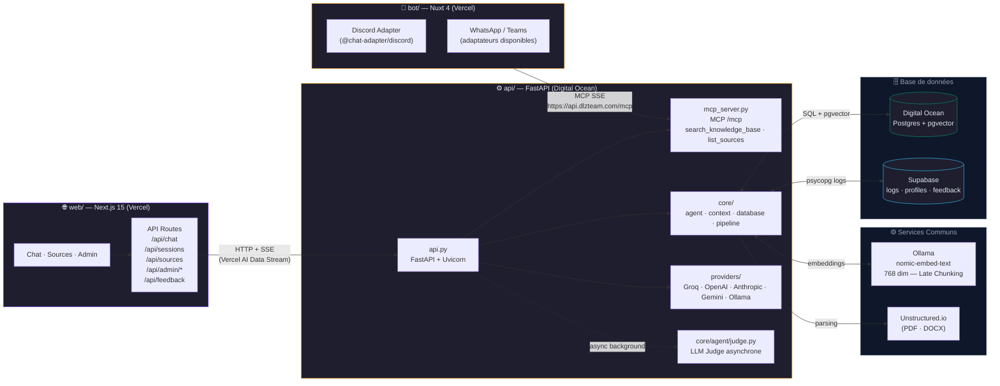
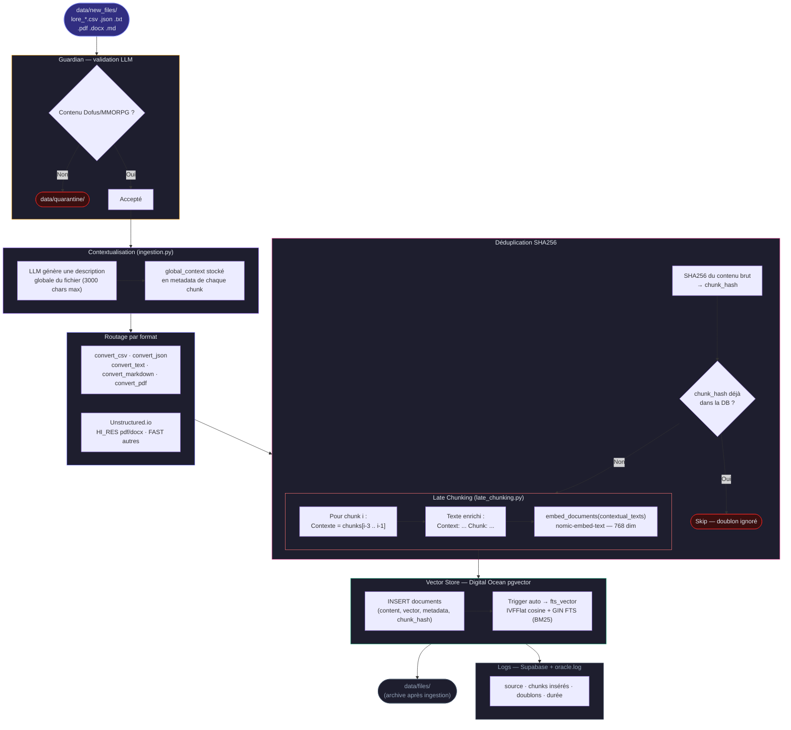
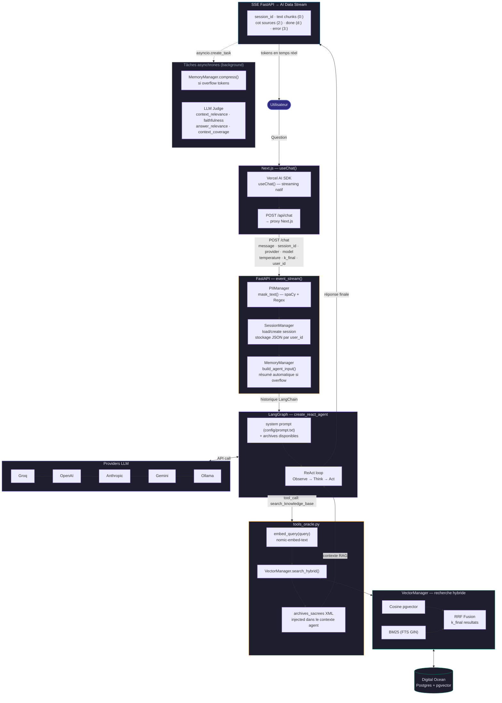
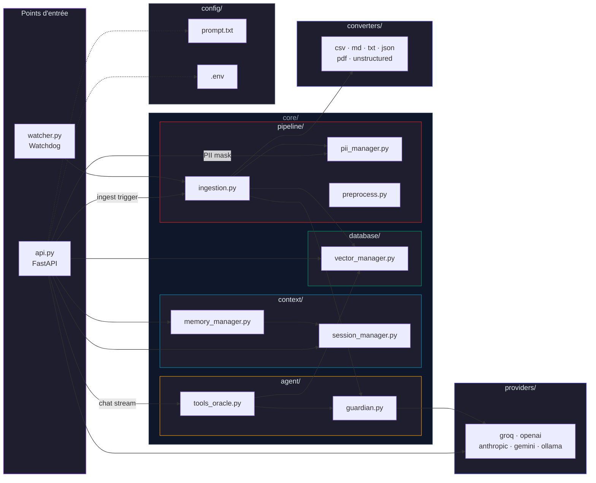
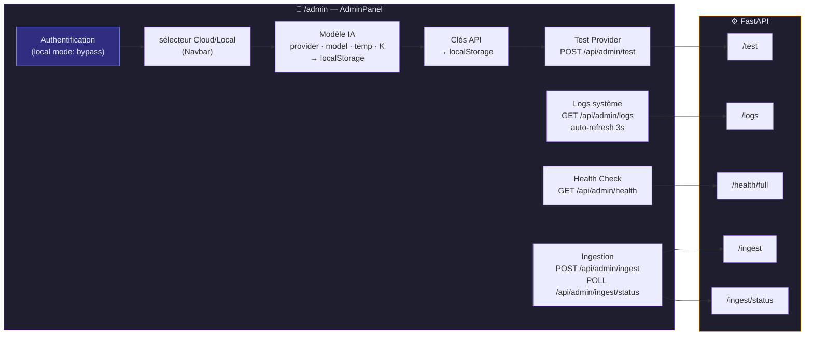
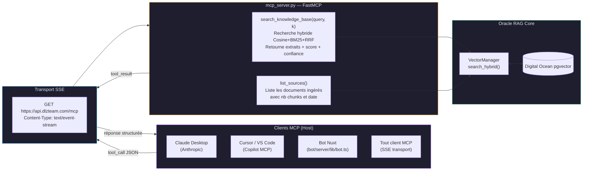
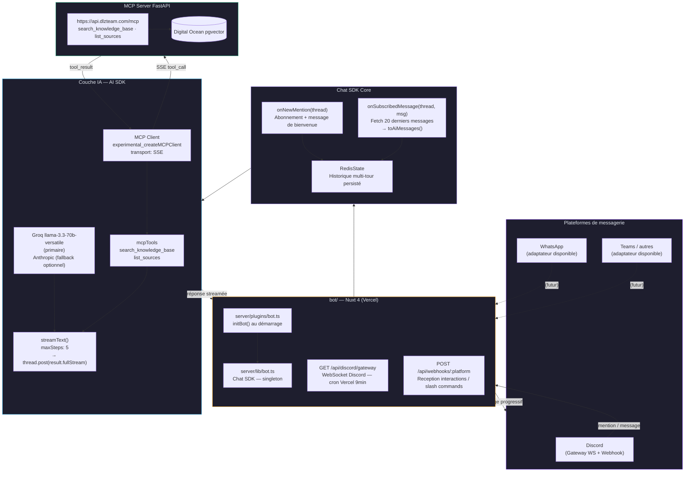

# 🔮 HELMo Oracle — Workflow Diagrams

## 1. Architecture globale

---

## 2. Pipeline d'ingestion

> Déclenché via `POST /ingest` (Admin UI) ou `watcher.py` (Watchdog automatique sur `data/new_files/`).

---

## 3. Flux de conversation — Chat Web (Vercel AI SDK + streamdown.ai)

> Rendu des tokens en temps réel via le protocole **Vercel AI Data Stream v1**.  
> Visualisation live possible sur **https://streamdown.ai/** (coller l'URL de l'API).

---

## 4. Architecture des modules

---

## 5. Panel Admin

---

## 6. Flux de conversation — Chat via MCP (Model Context Protocol)

> Le serveur MCP est monté sur **`https://api.dlzteam.com/mcp`** (FastAPI `app.mount("/mcp", ...)`).  
> Tout client MCP compatible peut se connecter et appeler les outils RAG directement.

---

## 7. Flux de conversation — Chat via Bot (Chat SDK)

> Implémenté avec le **Chat SDK** (`chat` + `@chat-adapter/*`) sur Nuxt 4.  
> **Discord** est opérationnel. **WhatsApp** et **Teams** sont supportés par les adaptateurs disponibles.

### Connexions possibles résumées

| Canal | Technologie | Statut | Appel RAG |
|---|---|---|---|
| **Web Chat** | Next.js + Vercel AI SDK `useChat()` | Opérationnel | `POST /chat` (SSE direct) |
| **MCP Client** (Claude Desktop, Cursor…) | MCP SSE | Opérationnel | `GET /mcp` → `search_knowledge_base` |
| **Discord Bot** | Chat SDK + `@chat-adapter/discord` | Opérationnel | MCP SSE → `search_knowledge_base` |
| **WhatsApp Bot** | Chat SDK + `@chat-adapter/whatsapp` | Disponible | MCP SSE → `search_knowledge_base` |
| **Teams / autres** | Chat SDK + adaptateur dédié | Disponible | MCP SSE → `search_knowledge_base` |