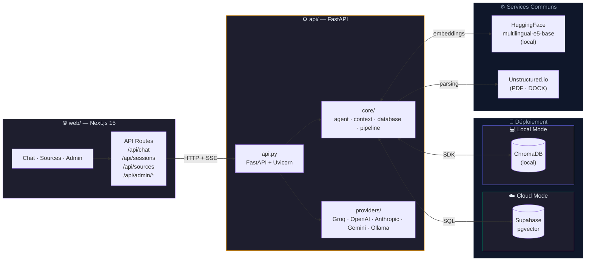
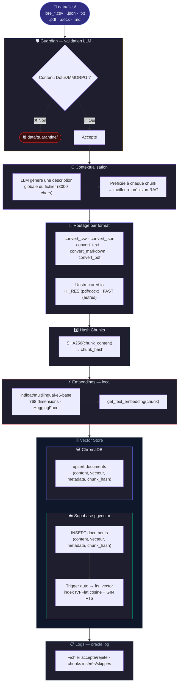
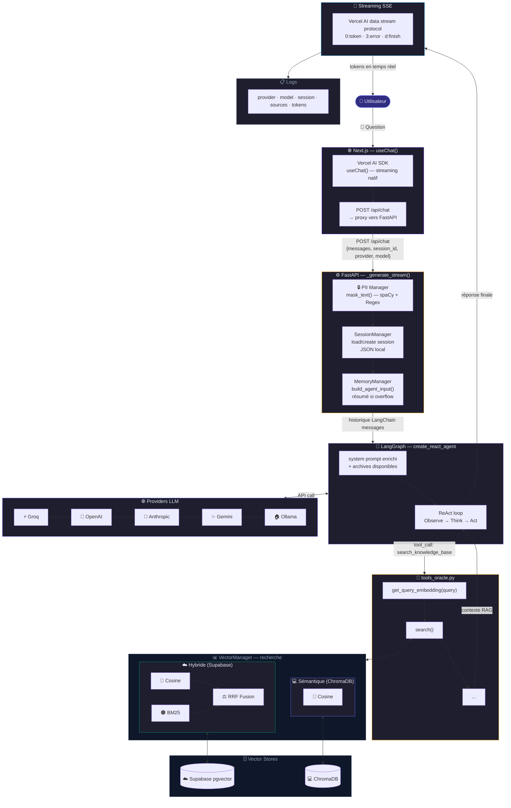
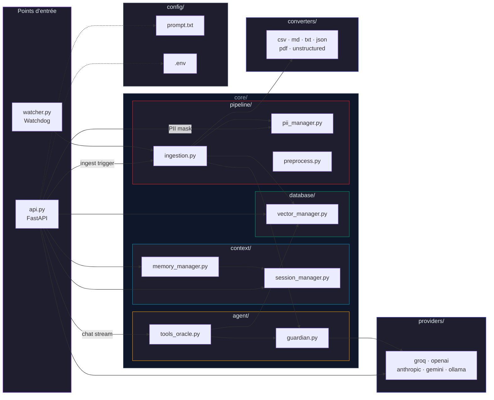
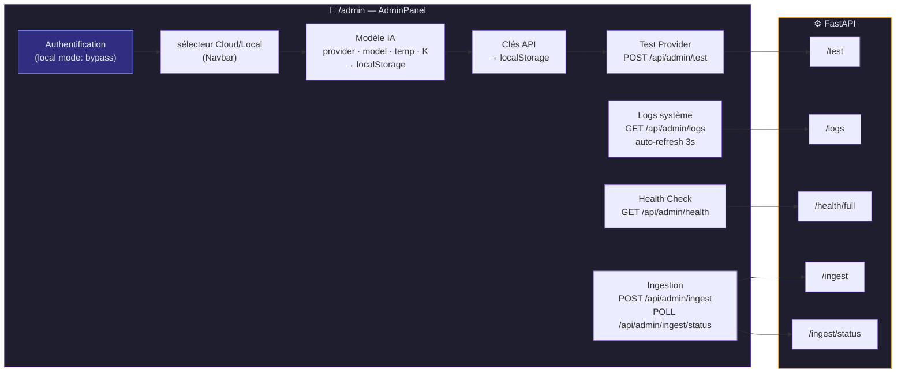

# 🔮 HELMo Oracle — Workflow Diagrams

## 1. Architecture globale

---

## 2. Pipeline d'ingestion

---

## 3. Flux de conversation (Runtime)

---

## 4. Architecture des modules

---

## 5. Panel Admin

