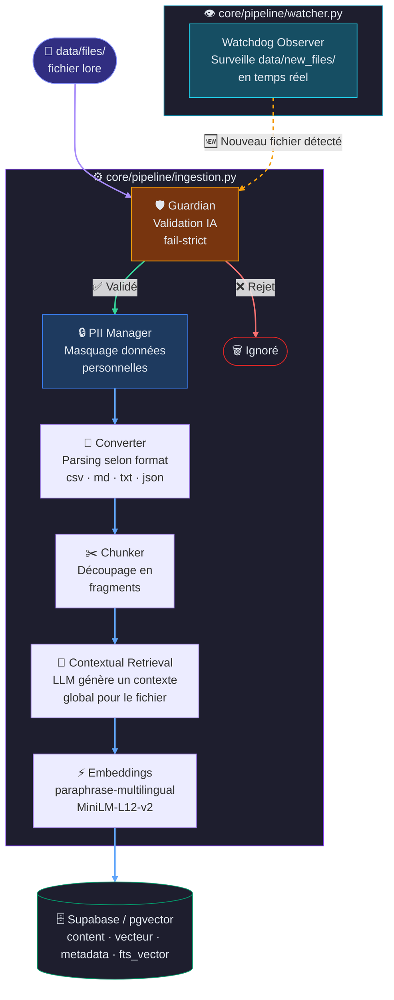
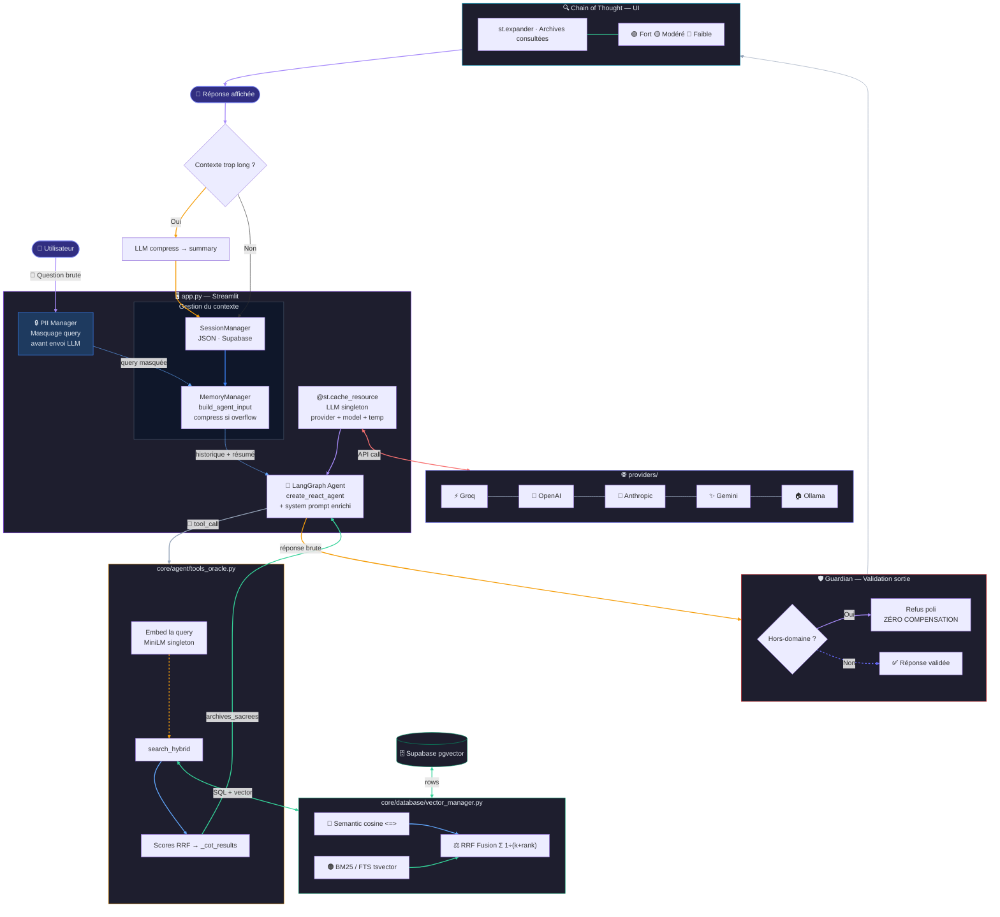
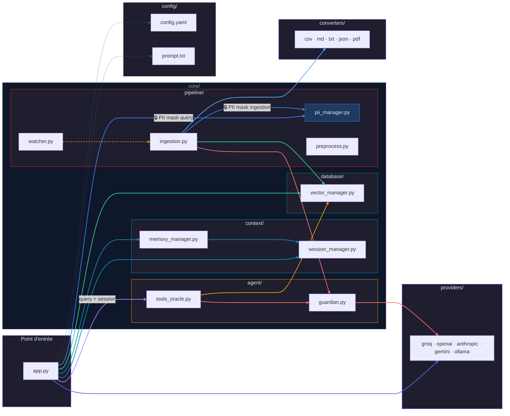

# 🔮 HELMo Oracle — Workflow Diagrams

## 1. Pipeline d'ingestion

```mermaid
flowchart TD
    A([📁 data/files/\n fichier lore]) --> B

    subgraph PIPELINE ["⚙️ core/pipeline/ingestion.py"]
        direction TB
        B[🛡️ Guardian\nValidation IA\nfail-strict]
        D[🔒 PII Manager\nMasquage données\npersonnelles]
        E[📄 Converter\nParsing selon format\ncsv · md · txt · json]
        F[✂️ Chunker\nDécoupage en\nfragments]
        G[🧠 Contextual Retrieval\nLLM génère un contexte\nglobal pour le fichier]
        H[⚡ Embeddings\nparaphrase-multilingual\nMiniLM-L12-v2]

        B -->|❌ Rejet| C([🗑️ Ignoré])
        B -->|✅ Validé| D
        D --> E --> F --> G --> H
    end

    H --> I[(🗄️ Supabase / pgvector\ncontent · vecteur · metadata · fts_vector)]

    subgraph WATCHER ["👁️ core/pipeline/watcher.py"]
        W[Watchdog Observer\nSurveille data/new_files/\nen temps réel]
    end

    W -->|"🆕 Nouveau fichier détecté"| B

    linkStyle 0 stroke:#a78bfa,stroke-width:2px
    linkStyle 1 stroke:#f87171,stroke-width:2px
    linkStyle 2 stroke:#34d399,stroke-width:2px
    linkStyle 3 stroke:#60a5fa,stroke-width:2px
    linkStyle 4 stroke:#60a5fa,stroke-width:2px
    linkStyle 5 stroke:#60a5fa,stroke-width:2px
    linkStyle 6 stroke:#60a5fa,stroke-width:2px
    linkStyle 7 stroke:#60a5fa,stroke-width:2px
    linkStyle 8 stroke:#f59e0b,stroke-width:2px,stroke-dasharray:5

    style PIPELINE fill:#1e1e2e,stroke:#7c3aed,color:#e2e8f0
    style WATCHER  fill:#1e1e2e,stroke:#0891b2,color:#e2e8f0
    style I        fill:#1e1e2e,stroke:#059669,color:#e2e8f0
    style C        fill:#1e1e2e,stroke:#dc2626,color:#e2e8f0
    style A        fill:#312e81,stroke:#818cf8,color:#e2e8f0
    style B        fill:#78350f,stroke:#f59e0b,color:#e2e8f0
    style D        fill:#1e3a5f,stroke:#3b82f6,color:#e2e8f0
    style W        fill:#164e63,stroke:#22d3ee,color:#e2e8f0
```

---

## 2. Flux de conversation (Runtime)

```mermaid
flowchart TD
    U([👤 Utilisateur]) -->|"💬 Question brute"| PII_Q

    subgraph APP ["🖥️ app.py — Streamlit"]
        direction TB

        PII_Q[🔒 PII Manager\nMasquage query\navant envoi LLM]

        subgraph CTX ["Gestion du contexte"]
            SS[SessionManager\nJSON · Supabase]
            MM[MemoryManager\nbuild_agent_input\ncompress si overflow]
            SS --> MM
        end

        LLM_CACHE["@st.cache_resource\nLLM singleton\nprovider + model + temp"]
        AGENT[🤖 LangGraph Agent\ncreate_react_agent\n+ system prompt enrichi]

        PII_Q -->|"query masquée"| MM
        MM -->|"historique + résumé"| AGENT
        LLM_CACHE --> AGENT
    end

    AGENT -->|"🔧 tool_call"| TOOL

    subgraph TOOL ["core/agent/tools_oracle.py"]
        T1[Embed la query\nMiniLM singleton]
        T2[search_hybrid]
        T3["Scores RRF → _cot_results"]
        T1 --> T2 --> T3
    end

    subgraph VM ["core/database/vector_manager.py"]
        direction LR
        S1["🔵 Semantic cosine <=>"]
        S2["🟠 BM25 / FTS tsvector"]
        RRF["⚖️ RRF Fusion Σ 1÷(k+rank)"]
        S1 --> RRF
        S2 --> RRF
    end

    T2 <-->|"SQL + vector"| VM
    DB[(🗄️ Supabase pgvector)] <-->|"rows"| VM
    T3 -->|"archives_sacrees"| AGENT

    AGENT -->|"réponse brute"| GUARD

    subgraph GUARD ["🛡️ Guardian — Validation sortie"]
        G1{"Hors-domaine ?"}
        G1 -->|Oui| G2["Refus poli\nZÉRO COMPENSATION"]
        G1 -->|Non| G3["✅ Réponse validée"]
    end

    subgraph PROVIDERS ["🌐 providers/"]
        direction LR
        P1["⚡ Groq"] --- P2["🤖 OpenAI"] --- P3["🧠 Anthropic"] --- P4["✨ Gemini"] --- P5["🏠 Ollama"]
    end

    LLM_CACHE <-->|"API call"| PROVIDERS

    subgraph COT ["🔍 Chain of Thought — UI"]
        C1["st.expander · Archives consultées"]
        C2["🟢 Fort  🟡 Modéré  🔴 Faible"]
        C1 --- C2
    end

    GUARD --> COT
    COT --> RESP([💬 Réponse affichée])
    RESP --> MEM{"Contexte trop long ?"}
    MEM -->|Oui| COMPRESS["LLM compress → summary"]
    COMPRESS --> SS
    MEM -->|Non| SS

    linkStyle 0  stroke:#a78bfa,stroke-width:2px
    linkStyle 1  stroke:#3b82f6,stroke-width:2px
    linkStyle 2  stroke:#60a5fa,stroke-width:1px
    linkStyle 3  stroke:#60a5fa,stroke-width:1px
    linkStyle 4  stroke:#a78bfa,stroke-width:2px
    linkStyle 5  stroke:#94a3b8,stroke-width:2px
    linkStyle 6  stroke:#f59e0b,stroke-width:2px,stroke-dasharray:4
    linkStyle 7  stroke:#60a5fa,stroke-width:2px
    linkStyle 8  stroke:#60a5fa,stroke-width:2px
    linkStyle 9  stroke:#34d399,stroke-width:2px
    linkStyle 10 stroke:#34d399,stroke-width:2px
    linkStyle 11 stroke:#34d399,stroke-width:2px
    linkStyle 12 stroke:#34d399,stroke-width:2px
    linkStyle 13 stroke:#f59e0b,stroke-width:2px
    linkStyle 14 stroke:#a78bfa,stroke-width:2px
    linkStyle 15 stroke:#6366f1,stroke-width:2px,stroke-dasharray:4
    linkStyle 16 stroke:#94a3b8,stroke-width:1px
    linkStyle 17 stroke:#94a3b8,stroke-width:1px
    linkStyle 18 stroke:#94a3b8,stroke-width:1px
    linkStyle 19 stroke:#94a3b8,stroke-width:1px
    linkStyle 20 stroke:#f87171,stroke-width:2px
    linkStyle 21 stroke:#34d399,stroke-width:2px
    linkStyle 22 stroke:#94a3b8,stroke-width:1px
    linkStyle 23 stroke:#a78bfa,stroke-width:2px
    linkStyle 24 stroke:#a78bfa,stroke-width:2px
    linkStyle 25 stroke:#f59e0b,stroke-width:2px
    linkStyle 26 stroke:#f59e0b,stroke-width:2px

    style APP       fill:#1e1e2e,stroke:#7c3aed,color:#e2e8f0
    style CTX       fill:#0f172a,stroke:#475569,color:#e2e8f0
    style TOOL      fill:#1e1e2e,stroke:#f59e0b,color:#e2e8f0
    style VM        fill:#1e1e2e,stroke:#059669,color:#e2e8f0
    style GUARD     fill:#1e1e2e,stroke:#dc2626,color:#e2e8f0
    style COT       fill:#1e1e2e,stroke:#0891b2,color:#e2e8f0
    style PROVIDERS fill:#1e1e2e,stroke:#6366f1,color:#e2e8f0
    style DB        fill:#1e1e2e,stroke:#059669,color:#e2e8f0
    style PII_Q     fill:#1e3a5f,stroke:#3b82f6,color:#e2e8f0
    style U         fill:#312e81,stroke:#818cf8,color:#e2e8f0
    style RESP      fill:#312e81,stroke:#818cf8,color:#e2e8f0
```

---

## 3. Architecture des modules

```mermaid
graph LR
    subgraph ENTRY ["Point d'entrée"]
        APP[app.py]
    end

    subgraph CORE ["core/"]
        subgraph AGENT ["agent/"]
            TO[tools_oracle.py]
            GU[guardian.py]
        end
        subgraph CONTEXT ["context/"]
            SM[session_manager.py]
            ME[memory_manager.py]
        end
        subgraph DATABASE ["database/"]
            VM[vector_manager.py]
        end
        subgraph PIPELINE ["pipeline/"]
            IN[ingestion.py]
            WA[watcher.py]
            PI[pii_manager.py]
            PR[preprocess.py]
        end
    end

    subgraph CONV ["converters/"]
        CV["csv · md · txt · json · pdf"]
    end

    subgraph PROV ["providers/"]
        PV["groq · openai · anthropic · gemini · ollama"]
    end

    subgraph CONF ["config/"]
        CF[config.yaml]
        PT[prompt.txt]
    end

    APP -->|"query + session"| TO
    APP -->|"🔒 PII mask query"| PI
    APP --> SM
    APP --> ME
    APP --> VM
    APP --> PV
    TO --> VM
    TO --> GU
    IN --> GU
    IN --> VM
    IN -->|"🔒 PII mask ingestion"| PI
    IN --> CV
    WA --> IN
    GU --> PV
    ME --> SM
    APP -.-> CF
    APP -.-> PT

    linkStyle 0  stroke:#a78bfa,stroke-width:2px
    linkStyle 1  stroke:#3b82f6,stroke-width:2px
    linkStyle 2  stroke:#0891b2,stroke-width:2px
    linkStyle 3  stroke:#0891b2,stroke-width:2px
    linkStyle 4  stroke:#34d399,stroke-width:2px
    linkStyle 5  stroke:#6366f1,stroke-width:2px
    linkStyle 6  stroke:#f59e0b,stroke-width:2px
    linkStyle 7  stroke:#f87171,stroke-width:2px
    linkStyle 8  stroke:#f87171,stroke-width:2px
    linkStyle 9  stroke:#34d399,stroke-width:2px
    linkStyle 10 stroke:#3b82f6,stroke-width:2px
    linkStyle 11 stroke:#60a5fa,stroke-width:2px
    linkStyle 12 stroke:#f59e0b,stroke-width:2px,stroke-dasharray:4
    linkStyle 13 stroke:#f87171,stroke-width:2px
    linkStyle 14 stroke:#0891b2,stroke-width:2px
    linkStyle 15 stroke:#475569,stroke-width:1px,stroke-dasharray:3
    linkStyle 16 stroke:#475569,stroke-width:1px,stroke-dasharray:3

    style ENTRY    fill:#1e1e2e,stroke:#7c3aed,color:#e2e8f0
    style CORE     fill:#0f172a,stroke:#334155,color:#94a3b8
    style AGENT    fill:#1e1e2e,stroke:#f59e0b,color:#e2e8f0
    style CONTEXT  fill:#1e1e2e,stroke:#0891b2,color:#e2e8f0
    style DATABASE fill:#1e1e2e,stroke:#059669,color:#e2e8f0
    style PIPELINE fill:#1e1e2e,stroke:#dc2626,color:#e2e8f0
    style CONV     fill:#1e1e2e,stroke:#6366f1,color:#e2e8f0
    style PROV     fill:#1e1e2e,stroke:#6366f1,color:#e2e8f0
    style CONF     fill:#1e1e2e,stroke:#475569,color:#e2e8f0
    style PI       fill:#1e3a5f,stroke:#3b82f6,color:#e2e8f0
```